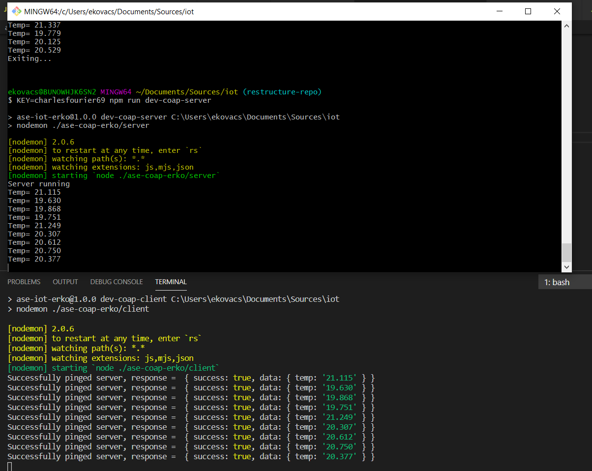
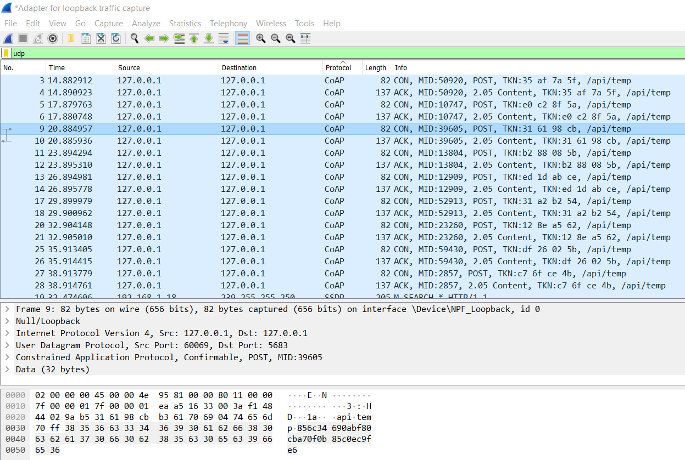
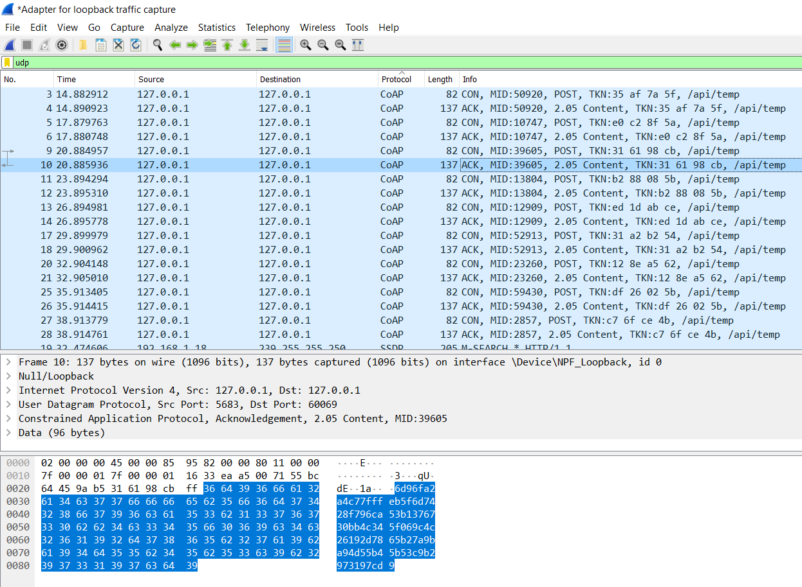
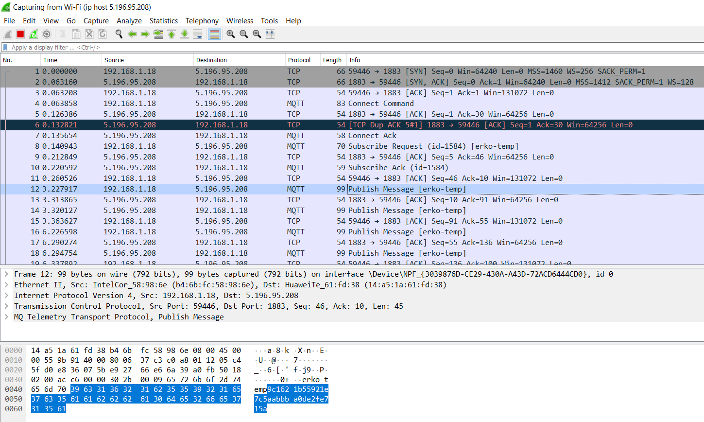

# ASE IOT Projects

## Dependencies
 - Node v13.9.0

## Prerequisites
 - Clone this repo
 - Install dependecies `npm install`

## For ASE-COAP-ERKO

 COAP Client and Server can be run using the following steps:
 - In a terminal provide a runtime key and run server `KEY=testpassword1234 npm run coap-server`
 - In a second terminal provide **the same** runtime key and run client `KEY=testpassword1234 npm run coap-client`
 - Use `Ctrl+C` to kill either process (the business logic is very simple - a random "room temperature" is pushed to the server every 3000ms until the client is killed - the server responds with a status flag and some metadata)

## How it works
The connection uses application-level encryption based on AES-128 in CBC mode with a pre-shared key provided as an environment variable and a known (hardcoded) IV. 

There are two scripts, one for the client and one for the server. They must be run in parallel so they can talk to each other over localhost:

Take a look at the data captured in Wireshark, it's encrypted (both the request and the response):

## For ASE-MQTT-ERKO
MQTT client can be run using the following steps:
 - In a terminal provide a runtime key and run client (containing both the publisher and the subscriber) `KEY=testpassword1234 npm run mqtt-client`
 - Use `Ctrl+C` to kill the process (the business logic is very simple - a random "room temperature" is published to the broker every 3000ms until it is killed)

## How it works
The connection uses application-level encryption based on AES-128 in CBC mode with a pre-shared key provided as an environment variable and a known (hardcoded) IV. 

For simplicity's sake we used the same script file as "both clients" but this is irrelevant - we could repeat the setup process for another client instance and process incoming data the exact same way, and the data would still be encryted. 

Take a look at the data captured in Wireshark, it's encrypted:

